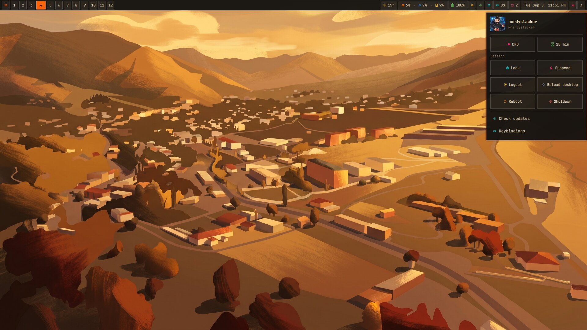

# anush

<div align="center">
<a href="https://github.com/nerdyslacker/anush"></a>
</div>

**anush** (_[ɑˈnuʃ]_) is a desktop shell named after my wife (_Անուշ_) currently integrated with
[skarwm](https://github.com/nerdyslacker/skarwm) to make it as beautiful as she
makes my life. It owns the bar, launchers,
clipboard, tray, weather, notifications, wallpaper tooling, desktop
configuration, and persistent shell state. It does not own or launch a window
manager; a WM configuration starts the shell by pointing Quickshell at
`anush/shell`.

<div align="center">

</div>

## Dependencies

Required:

- Quickshell;
- Python 3 for state migration and shell helpers;
- a JetBrainsMono Nerd Font for the intended icons and typography;
- for the current skarwm adapter, `skarwm-msg` available in `PATH`.

Optional desktop integrations:

- Picom, Dunst, Feh, and Kitty for the supplied desktop configuration;
- Clipmenu and Xdotool for clipboard history and pasting;
- `setxkbmap` and `xkb-switch` for keyboard layouts;
- renCal for calendar events;
- NetworkManager tools, BlueZ, `pactl`, and Pavucontrol for network and audio;
- brightnessctl, powerprofilesctl, redshift, xset, and xrandr for hardware and
  power controls;
- curl, xdg-open, flameshot, xinput, notify-send, and xterm for individual
  widget actions;
- ImageMagick for wallpaper-derived themes;
- lxqt-policykit-agent, xss-lock, Betterlockscreen, and Udiskie for the supplied
  full desktop startup configuration.

Missing optional tools disable only the related action or widget. renCal is
available from the LazyLinux repository used by skarwm for Odin:

```sh
printf '%s\n' 'repository=https://github.com/lazylinuxos/lazy-repo/releases/latest/download' \
  | sudo tee /etc/xbps.d/99-repository-lazy.conf
```
```sh
sudo xbps-install -S quickshell picom dunst feh kitty xss-lock \
  betterlockscreen udiskie lxqt-policykit NetworkManager bluez pavucontrol \
  curl flameshot brightnessctl xrandr python3 renCal xterm xinput xdotool \
  clipmenu xkb-switch setxkbmap ImageMagick
```

Package availability depends on the enabled Void repositories; the Nerd Font may need separate installation.

## Install and launch

Install into `${XDG_CONFIG_HOME:-$HOME/.config}/anush`:

```sh
make install
```

Launch it directly with:

```sh
qs --no-duplicate -p ~/.config/anush/shell
```

There is deliberately no anush session executable or display-manager entry.
The active WM decides how to start the shell. For skarwm, copy the supplied
configuration or add the autostart command yourself:

```sh
cp ~/.config/anush/config/skarwm/config.rc ~/.config/skarwm/config.rc
```

```text
autostart : "qs --no-duplicate -p ~/.config/anush/shell"
```

Future WM integrations belong under `config/<wm>/` and should point to the
same shell entry point without coupling anush to their session lifecycle.

## Layout

```text
config/                 external application and WM integration examples
shell/common/           shared QML types and state management
shell/components/       QML grouped by feature
shell/scripts/          shell helper programs
shell/states/           default state document
shell/shell.qml         Quickshell entry point
```

## State and configuration

Persistent settings live in
`${XDG_STATE_HOME:-$HOME/.local/state}/anush/shell-state.json`. Set
`ANUSH_STATE_DIR` to override that directory. The sections are `bar`,
`weather`, `keyboard`, `tray`, `tags`, `pomodoro`, `theme`, `windowManager`,
and `desktop`.

`ShellState.qml` merges section updates and writes the complete document
atomically. On first launch, it imports compatible state from the former
skarwm files when present; afterward `shell-state.json` is the only active
state source.

Application configuration is under `config/`, shell scripts are always
resolved relative to `shell/`, and QML components are grouped by function
under `shell/components/`.

## Inspiration

The desktop setup was inspired by
[drew/dwm-setup](https://justaguy.dev/drew/dwm-setup).
