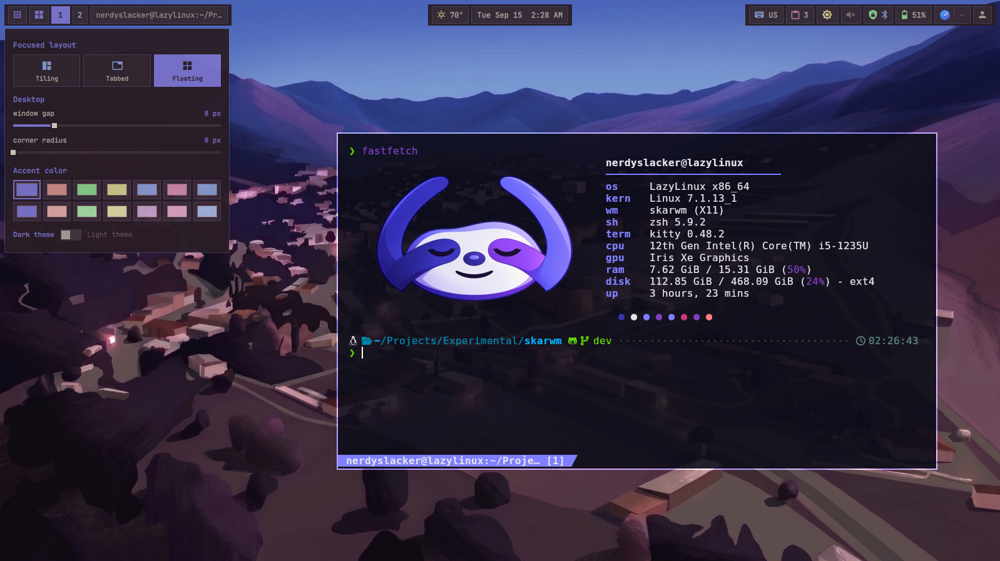

# anush

<div align="center">
<a href="https://github.com/nerdyslacker/anush"></a>
</div>

**anush** (_[ɑˈnuʃ]_) is a desktop shell named after my wife (_Անուշ_) currently integrated with
[skarwm](https://github.com/nerdyslacker/skarwm) to make it as beautiful as she
makes my life. It owns the bar, launchers,
clipboard, tray, weather, notifications, wallpaper tooling, desktop
configuration, and persistent shell state. It does not own or launch a window
manager; a WM configuration starts the shell by pointing Quickshell at
`anush/shell`.

<div align="center">

</div>

## Dependencies

Required:

- Quickshell;
- Python 3 for state migration and shell helpers;
- Papirus icon theme for application and accent-matched folder icons;
- JetBrainsMono Nerd Font for typography and Symbols Nerd Font Mono for
  consistently sized bar icons;
- for the current skarwm adapter, `skarwm-msg` available in `PATH`.

Optional desktop integrations:

- Picom, Dunst, Feh, and Kitty for the supplied desktop configuration;
- Clipmenu and Xdotool for clipboard history and pasting;
- `setxkbmap` and `xkb-switch` for keyboard layouts;
- renCal for calendar events;
- NetworkManager, its command-line/editor tools, BlueZ, Blueman, `pactl`, and
  Pavucontrol for network, Bluetooth, and audio controls;
- Easy Effects for optional audio-effect bypass and preset controls;
- brightnessctl, powerprofilesctl, redshift, xset, and xrandr for hardware and
  power controls;
- curl, xcolor, xdg-open, flameshot, xinput, notify-send, and xterm for individual
  widget actions;
- ImageMagick for wallpaper-derived themes;
- lxqt-policykit-agent, xss-lock, Betterlockscreen, and Udiskie for the supplied
  full desktop startup configuration.

Missing optional tools disable only the related action or widget. renCal is
available from the LazyLinux repository used by skarwm for Odin:

```sh
printf '%s\n' 'repository=https://github.com/lazylinuxos/lazy-repo/releases/latest/download' \
  | sudo tee /etc/xbps.d/99-repository-lazy.conf
```
```sh
sudo xbps-install -S quickshell picom dunst feh kitty xss-lock \
  betterlockscreen udiskie lxqt-policykit NetworkManager bluez blueman pavucontrol \
  curl flameshot brightnessctl xrandr python3 renCal xterm xinput xdotool xcolor \
  clipmenu xkb-switch setxkbmap ImageMagick
```

Package availability depends on the enabled Void repositories; the Nerd Font may need separate installation.

## Install and launch

Install the program and data under the configured system prefix:

```sh
make install
```

On the first `anushctl start`, the CLI detects the installed data and seeds
`${XDG_CONFIG_HOME:-$HOME/.config}/anush` itself. No separate initialization
script is required. Later starts refresh managed shell code and assets while
leaving the user-owned `config/` directory unchanged.

Launch it directly with:

```sh
anushctl start
```

The install also provides the Odin-based `anushctl` management utility. It
uses Anush's typed Quickshell IPC endpoints for runtime control:

```sh
anushctl status
anushctl reload
anushctl lock
anushctl launcher toggle
anushctl notes toggle
anushctl popup network
anushctl wallpaper set ~/Pictures/wallpaper.jpg
anushctl theme mode dark
```

It can add or remove idempotent shell startup and keybinding blocks without
overwriting the rest of an existing compositor configuration:

```sh
anushctl install skarwm
```

See [`docs/anushctl.md`](docs/anushctl.md) for the full command tree, exit
codes, config paths, and protocol notes.

There is deliberately no anush session executable or display-manager entry.
The active WM decides how to start the shell. For skarwm, copy the supplied
configuration or add the autostart command yourself:

```sh
cp "${XDG_CONFIG_HOME:-$HOME/.config}/anush/config/skarwm/config.rc" \
   "${XDG_CONFIG_HOME:-$HOME/.config}/skarwm/config.rc"
```

```text
autostart : "anushctl start"
```

Future WM integrations belong under `config/<wm>/` and should point to the
same shell entry point without coupling anush to their session lifecycle.

With a current skarwm build, anush also replaces the WM's native keybinding,
notice, and reminder windows automatically. The keybinding window searches
both shortcuts and action descriptions and highlights every matching row.
Reminder expiry notices remain visible until clicked; ordinary status notices
still close after 2.5 seconds. If anush is not running, skarwm falls back to its
built-in windows.

## Layout

```text
config/                 external application and WM integration examples
shell/common/           shared QML types and state management
shell/components/       QML grouped by feature
shell/scripts/          shell helper programs
shell/states/           default state document
shell/shell.qml         Quickshell entry point
```

## State and configuration

Persistent settings live in
`${XDG_STATE_HOME:-$HOME/.local/state}/anush/shell-state.json`. Set
`ANUSH_STATE_DIR` to override that directory. The sections are `bar`,
`weather`, `launcher`, `keyboard`, `tray`, `tags`, `pomodoro`, `theme`,
`windowManager`, `windowList`, and `desktop`.

The optional **Window list** Bar widget uses one shared pill containing one
icon per application. Clicking a group with multiple windows opens a window
picker; a single-window group focuses immediately. Each Bar shows windows from
the workspace currently displayed on that Bar's output and, by default, only
windows on that output. Right-click the pill or any icon to toggle the
persistent cross-monitor view. That mode removes only the output filter; it
keeps the owning Bar's workspace filter:

```json
"windowList": {
  "showWindowsFromAllMonitors": false
}
```

Right-click the launcher button to choose an icon-theme icon, a searchable
distribution logo from `assets/distro-logos.json`, or an image file. Image
paths inside the anush config directory are stored relative to that directory
for portability. An unavailable or deleted custom icon falls back to the
built-in anush glyph; **Reset** clears the saved customization.

The audio widget opens the native mixer with a left click, toggles output mute
with a middle click, and opens Easy Effects controls with a right click. When
Easy Effects is installed, that popup controls global bypass, selects input and
output presets, refreshes their state, or opens the full application. The
normal mixer remains available when Easy Effects is absent.

Rounded corners are controlled by the canonical `theme.cornerRadius` value.
It is watched at runtime along with the rest of the state, so editing the state
file updates open shell surfaces without a restart. `0` keeps every non-circular
surface square; larger values derive coherent small, medium, and large radii:

```json
"theme": {
  "cornerRadius": 10
}
```

Committing the corner-radius slider also updates `corner_radius` in
`config/skarwm/config.rc` atomically and requests a skarwm configuration reload.
Set `ANUSH_CONFIG_DIR` when anush's writable configuration lives somewhere
other than its installed `config/` directory.

The layout/appearance popup includes selectable palette cards for Srcery,
Catppuccin, Gruvbox, and Everforest in dark and light variants, plus the
Windows 95-inspired Classic palette. The selection and its corresponding mode
are stored as `theme.preset` and `theme.mode` and update the running shell
immediately:

```json
"theme": {
  "preset": "everforest-light",
  "mode": "light"
}
```

`Theme.qml` exposes mode-independent roles including `background`, `surface`,
`surfaceVariant`, `foreground`, `foregroundMuted`, `accent`,
`accentForeground`, `activeBackground`, `activeBorder`, `outline`, `hover`,
`pressed`, `error`, `warning`, `success`, `shadow`, and `overlay`. Built-in and
wallpaper-derived palettes both populate this API, allowing future palette
generators to remain separate from component styling.

In light mode, wallpaper-derived palettes lift the wallpaper's dominant
background hue into a light surface and enforce readable contrast for text and
accent roles; the fixed Srcery light theme continues to use its canonical cream.

Bars can optionally shrink along their long axis to their natural widget size
while the native panel window remains centered on each screen. This keeps the
surrounding desktop clickable and preserves the bar's workspace reservation:

```json
"bar": {
  "fitContent": true,
  "floating": true,
  "separateSections": false
}
```

These settings are also available as **Fit to content** and **Floating**
in the bar layout popup. Floating mode uses the same 8-pixel gap as bar
popups; a full-width horizontal bar is inset from the left and right edges as
well. The workspace reservation remains intact.

On full-length bars, **Sections** can replace the continuous background with
separate start, center, and end surfaces. Empty sections are not drawn; side
bars arrange the three surfaces vertically.

The power menu's **Display settings** item opens a centered XRandR-backed
configuration surface. Changes are staged until **Apply**; mode, refresh rate,
scale, orientation, enabled state, primary output, mirroring, and snapped
monitor positions are configured together. Potentially disruptive changes
must be confirmed within 15 seconds or the independent rollback watchdog
restores the previous layout. XRandR remains the persistence owner.

`ShellState.qml` merges section updates and writes the complete document
atomically. On first launch, it imports compatible state from the former
skarwm files when present; afterward `shell-state.json` is the only active
state source.

The **Notepad** bar widget opens an animated sidebar from the configurable left
or right screen edge. It supports multiple tabbed UTF-8 Markdown notes under
`${XDG_DATA_HOME:-$HOME/.local/share}/anush/notepad/`; the `+` tab button creates
a new file. The header provides compact/extended width and close controls; the
footer persists whether the drawer opens from the left or right. Writes are
debounced and atomic, and failures or external changes
never discard the in-memory text. Set `ANUSH_NOTEPAD_DIR` to choose another
directory. `ANUSH_NOTES_FILE` remains available for a specific legacy file.
The sidebar can also be controlled through `anushctl`:

```sh
anushctl notes toggle
anushctl notes new
anushctl notes save
```

The supplied skarwm configuration binds `Super+Shift+N` to toggle Notepad.
The shortcut calls the global Notepad IPC handler directly, so it remains
available when the Notepad bar widget is hidden.

Application configuration is under `config/`, shell scripts are always
resolved relative to `shell/`, and QML components are grouped by function
under `shell/components/`.

## Inspiration

The desktop setup was inspired by
[drew/dwm-setup](https://justaguy.dev/drew/dwm-setup).
