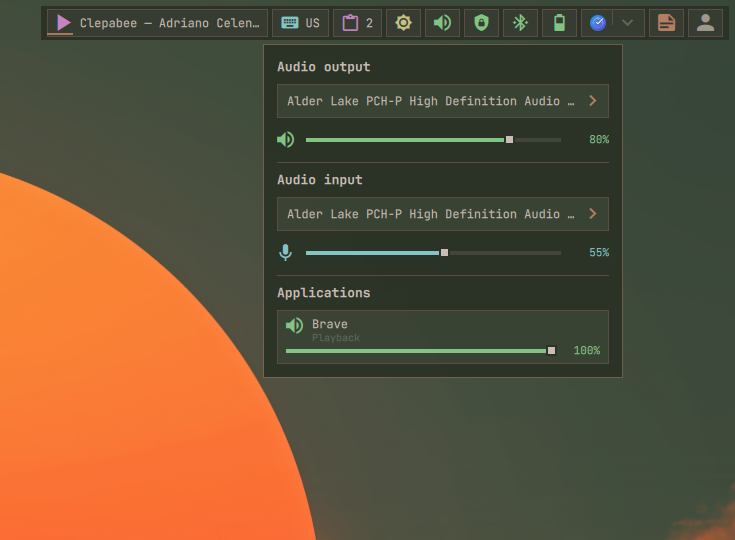
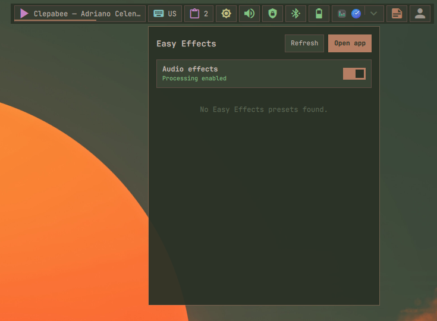

# Audio

Shows the default output volume and mute state. Its popups provide stream,
device, microphone, and Easy Effects controls.

## Actions

- **Left click:** Open the audio mixer.

  

- **Middle click:** Mute or unmute the default output.

- **Right click:** Open Easy Effects controls.

  

- **Scroll:** Raise or lower volume in two-percent steps and unmute the output.
