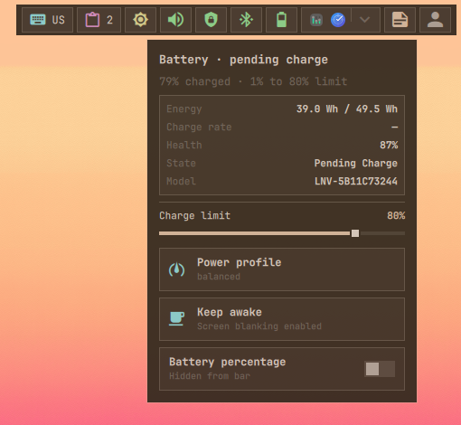

# Battery

Shows battery percentage, charging state, low-charge warnings, and keep-awake
status when a battery is present.

## Actions

- **Left click:** Open battery, power-profile, keep-awake, and charge-limit controls.

  
