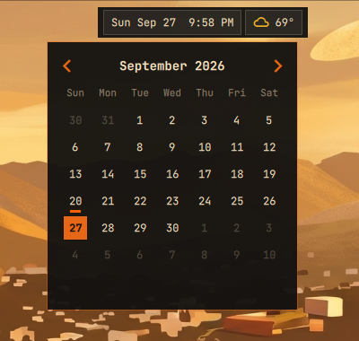
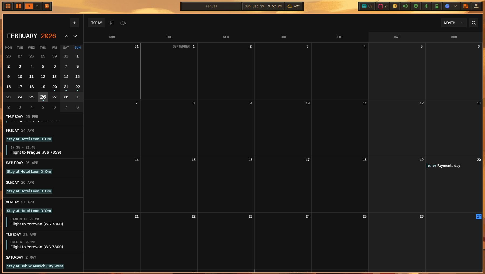

# Clock

Shows the current date and time and anchors the calendar and event view.

## Actions

- **Left click:** Open the calendar.

  

- **Middle click:** Open the calendar, like left click.

- **Right click:** Open `renCal` when installed; otherwise open the calendar.

  
