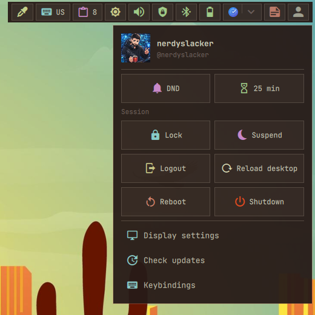
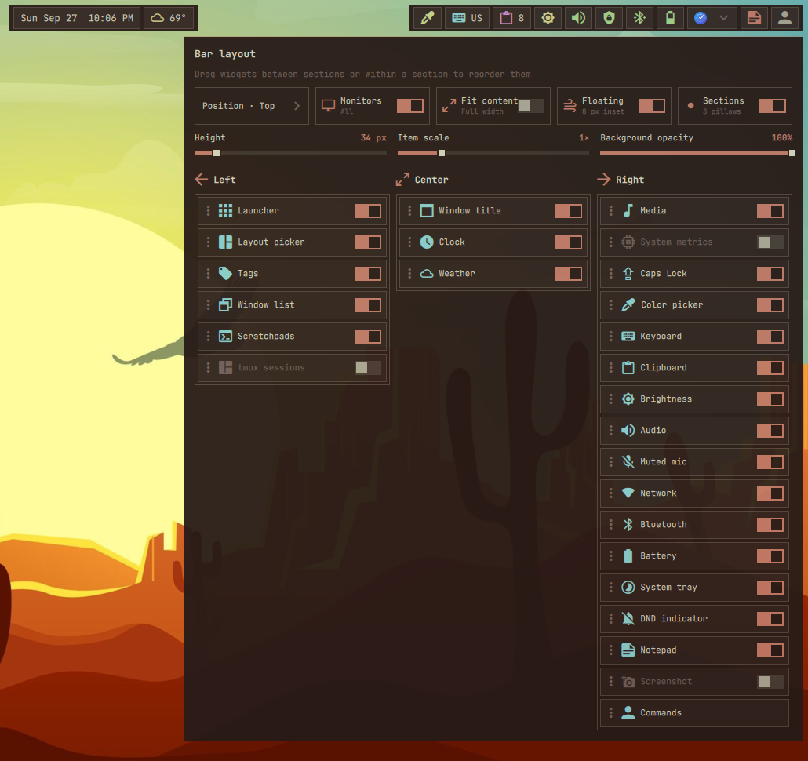

# Commands

Opens session, focus, display, power, notification, and Pomodoro controls. This
mandatory widget also provides the bar configuration entry point.

## Actions

- **Left click:** Open or close the commands menu.

  

- **Right click:** Open bar layout and visibility settings.

  
