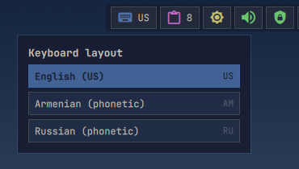
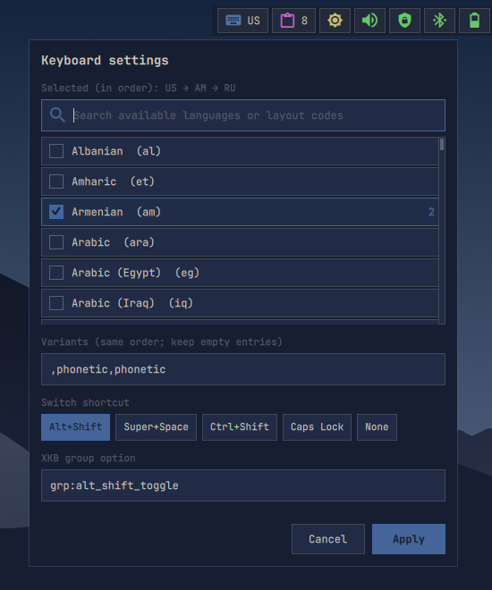

# Keyboard

Shows the active XKB layout and provides layout selection and configuration.

## Actions

- **Left click:** Open the configured layout picker.

  

- **Middle click:** Open the layout picker, like left click.

- **Right click:** Open layout, variant, and shortcut settings.

  
