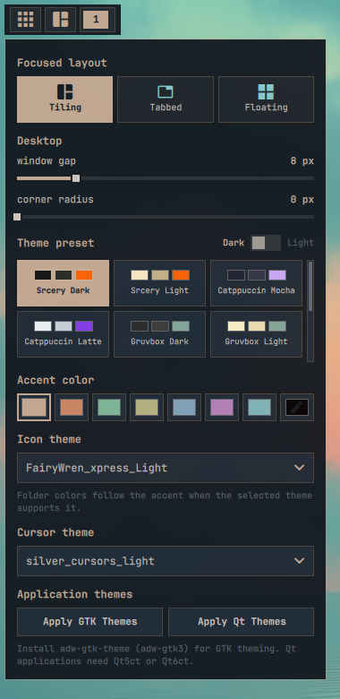
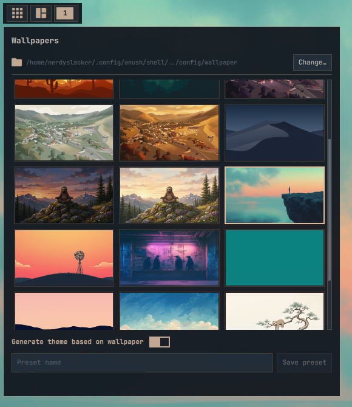

# Layout picker

Shows the current skarwm workspace layout and provides desktop appearance,
layout, theme, wallpaper, icon, and cursor controls. The available workspace
layouts are Scrolling Tile, Dwindle/Fibonacci, Monocle, and Floating. Tabbed
is also available for the focused column. The configured keyboard
shortcut handles per-window floating.

## Actions

- **Left click:** Open appearance and layout controls.

  

- **Middle click:** Apply a random wallpaper.
- **Right click:** Open the wallpaper picker.

  

- **Scroll:** Cycle through workspace layouts.
