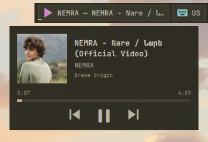

# Media

Shows the active MPRIS player, track title, playback state, and progress when
available.

## Actions

- **Left click:** Toggle play or pause.
- **Middle click:** Hide the widget until the player or track changes.
- **Right click:** Open now-playing controls and the player selector.

  

- **Scroll up/down:** Play the previous or next track.
