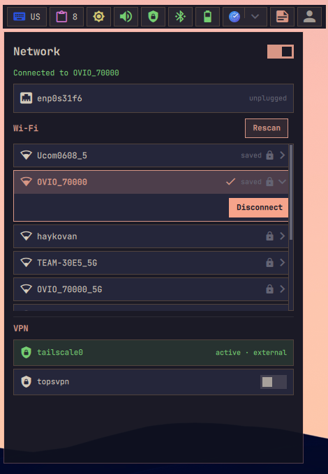
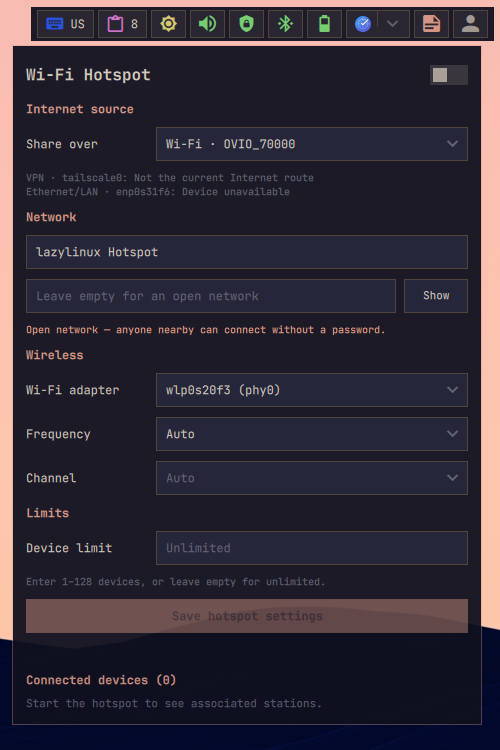
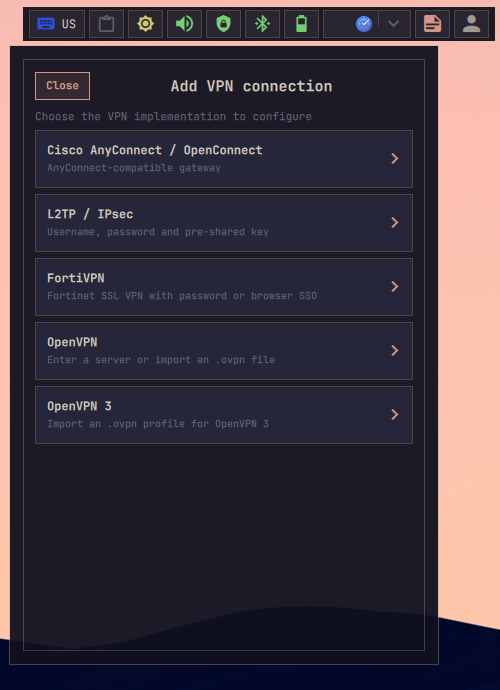
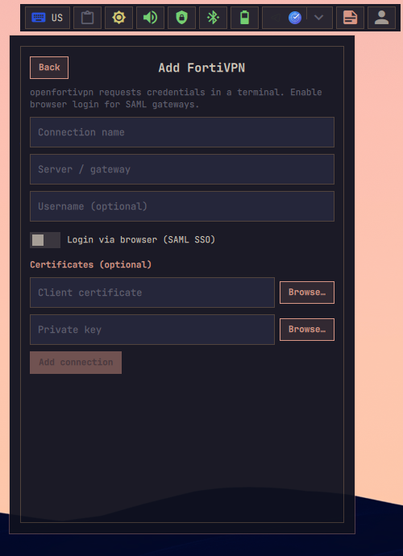

# Network

Shows the active network transport, VPN state, connectivity, and hotspot state.

## Actions

- **Left click:** Open quick network and VPN controls.

  

  The **Add** button beside VPN creates Cisco AnyConnect/OpenConnect, L2TP/IPsec,
  FortiVPN, or OpenVPN NetworkManager profiles. OpenVPN configuration files can
  be imported into either NetworkManager or OpenVPN 3 with an optional custom
  connection name. OpenVPN 3 connections start directly in the background;
  profiles that require an interactive credential not stored by OpenVPN 3
  report the authentication error in the popup instead of opening a terminal.

- **Middle click:** Open NetworkManager connection settings if available.
- **Right click:** Open hotspot controls.

  

VPN support depends on the matching client and NetworkManager plugin being
installed. Install the implementations needed by your profiles:

- `networkmanager-openvpn`
- `networkmanager-strongswan`
- `networkmanager-l2tp`
- `networkmanager-openconnect`
- `openvpn3`
- `openfortivpn`

Package names can vary by distribution. Creating profiles with saved secrets
also requires the Python NetworkManager bindings (`python3-gobject` plus the
libnm GIR package).

OpenVPN, OpenConnect, and FortiVPN forms can select a CA certificate, client
certificate, and private key where supported. A configuration imported from an
OpenVPN file keeps the certificate settings from that file.

  

Clicking a VPN row expands its actions. Saved NetworkManager VPN profiles can
be edited or removed; OpenVPN 3 profiles can be removed but remain
import-managed and must be re-imported when their underlying configuration
changes. Active profiles must be disconnected first, and removal requires a
second confirmation click. The editor can change the name, gateway, username,
certificates, L2TP key, or FortiVPN SAML settings. Leaving a password or
pre-shared-key field blank while editing keeps its stored value.

FortiVPN connections run with `openfortivpn` in an attached terminal. Standard
profiles request their password there instead of saving it in the profile; the
terminal remains open so closing it cleanly stops the tunnel.

  

For a Fortinet gateway using SAML, enable **Login via browser (SAML SSO)** and
set its local callback port if the default `8020` is unavailable. Connecting
starts `openfortivpn --saml-login`, opens the gateway login page in the default
browser, and receives the successful redirect on `127.0.0.1` at that port. The
terminal must remain open while this independently managed tunnel is active.
