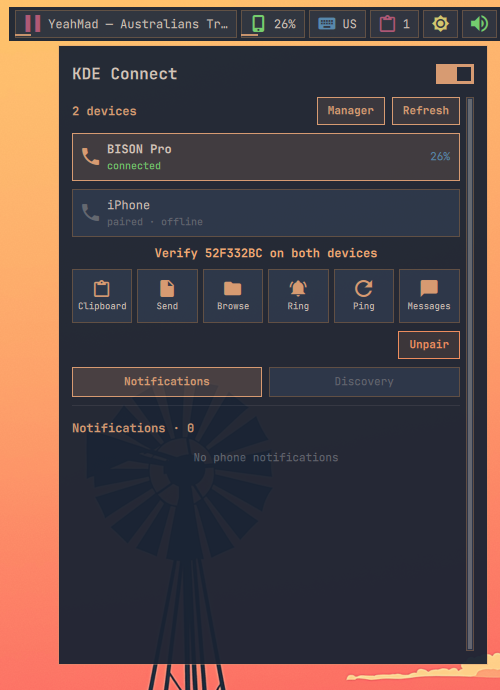

# Phone connect

Provides one bar widget for either KDE Connect or Valent. KDE Connect is used
when both backends are running. The widget shows the connected device and its
battery level; its popup supports multiple devices, discovery, pairing, ping,
ringing, clipboard push, multi-file sharing through a native picker, and browsing
remote files when the corresponding phone plugin is enabled. The header switch
starts or stops the installed backend.

## Discovery beyond the LAN

With KDE Connect, **Discover** refreshes normal LAN discovery and any addresses
already saved by KDE Connect. The Discovery section can add a literal IPv4 or
IPv6 address or resolve a local machine name. Saved endpoints are written to
KDE Connect's own `customDevices` property, rather than a separate anush config,
and can be removed from the same panel.

If the `tailscale` command is installed and connected, the panel reads
`tailscale status --json`, shows this computer's Tailscale address, and lists
tailnet peers by machine name. Choose **Add** beside a peer to save its stable
Tailscale IPv4 address in KDE Connect. This uses no API token and does not
replace KDE Connect's encrypted pairing. TCP and UDP ports 1714–1764 still need
to be permitted on the relevant LAN or Tailscale interface.

KDE Connect additionally provides an in-panel SMS inbox, conversation history,
replies, synced-contact search, and new-message composition. Grant SMS and
Contacts permissions for this computer in the phone app. Valent does not export
equivalent message data through its public D-Bus API, so its SMS button opens
Valent's Messages window instead.

The selected KDE Connect device also shows its active phone notifications.
Dismissable notifications can be cleared from the panel. A **Reply** button is
shown only when Android and the originating application expose an inline reply
identifier. This commonly supports WhatsApp, Telegram, Signal, and other chat
notifications, but availability is controlled by the phone application and its
notification settings. Notification previews and SMS inbox previews are kept to
one line with an ellipsis; opening an SMS conversation still shows its full text.
After a successful quick reply, Anush asks KDE Connect to dismiss the original
notification when it is dismissable. Reply text is delivered to the helper over
standard input, so private chat content is not exposed in the process command
line.

## Requirements

Install either `kdeconnect` or `valent`, plus PyGObject (`python3-gobject` on
many distributions). Start `kdeconnectd` or `valent --gapplication-service`,
then install KDE Connect on the phone and keep both devices on the same local
network. KDE Connect normally uses TCP and UDP ports 1714–1764, which must be
allowed by the firewall.

File browsing additionally needs the backend's normal filesystem support:
`sshfs` and a `kdeconnect://` handler for KDE Connect, or GVfs SFTP support for
Valent.

## Actions

- **Left click:** Open phone controls.
  

- **Middle click:** Refresh backend and device state.
- **Right click:** Open the active backend's full application.

The popup only enables actions advertised by the selected device. Arguments are
passed directly and never evaluated by a shell; notification quick replies use
standard input. The same popup can be opened with
`anushctl popup phone`.
