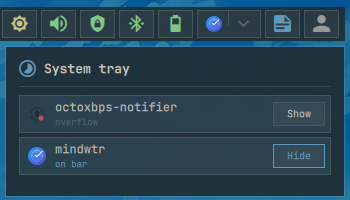

# System tray

Hosts StatusNotifier items and keeps hidden items in an overflow popup.

## Actions

- **Left click an item:** Activate it, or open its menu when it is menu-only.
- **Middle click an item:** Run its secondary activation action.
- **Right click an item:** Open its menu when available.
- **Left click the overflow arrow:** Open or close the list of all tray items and choose which stay on the bar.

  
