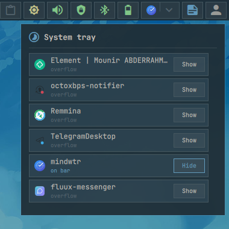

# System tray

Hosts StatusNotifier items and keeps hidden items in an overflow popup.

## Actions

- **Left click an item:** Activate it, or open its menu when it is menu-only.
- **Middle click an item:** Run its secondary activation action.
- **Right click an item:** Open its menu when available.
- **Left click the overflow arrow:** Open or close a compact grid containing
  hidden running tray applications, with up to five icons per row.

    

- **Right click the overflow arrow:** Open the full tray list and choose which
  applications stay on the bar or move into the hidden-items grid.

  
