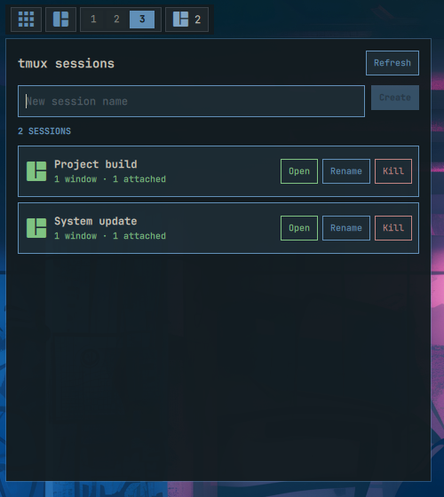

# tmux sessions

Shows the number of tmux sessions and provides a compact session manager when
tmux is installed.

## Actions

- **Left click:** Open the tmux session manager.

  

- **Middle click:** Refresh the session list.
