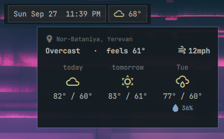
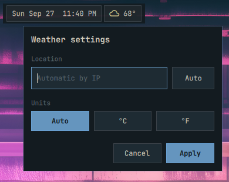

# Weather

Shows current conditions and temperature from the configured weather location.

## Actions

- **Left click:** Open the forecast; retries the fetch when no data is available.

  

- **Middle click:** Open the forecast, like left click.
- **Right click:** Open location and unit settings.

  
