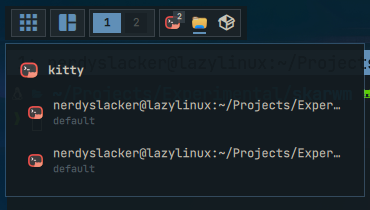
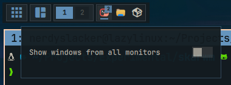

# Window list

Displays application icons for windows on the current tag. Windows from the
same application are grouped together.

## Actions

- **Left click an application:** Focus its window, or open a chooser when the application has multiple windows.

  

- **Right click:** Open window-list settings.

  

- **Scroll an overflowing list:** Move through hidden application icons.
